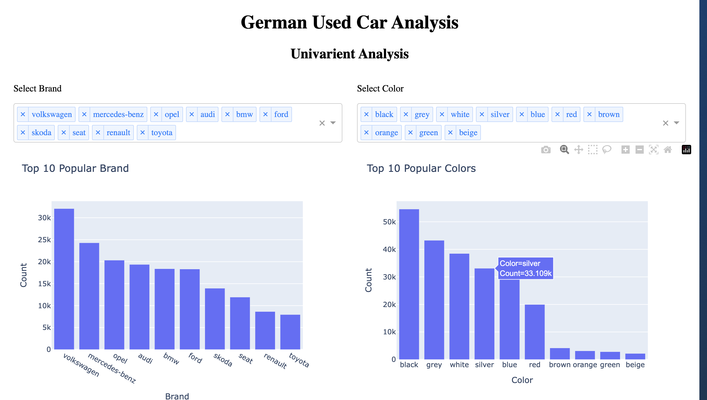
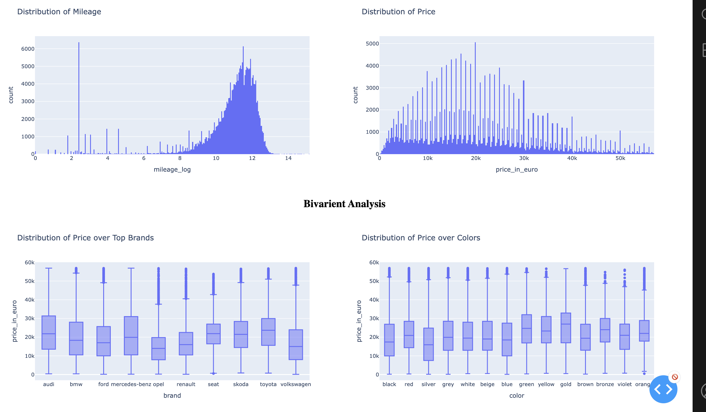
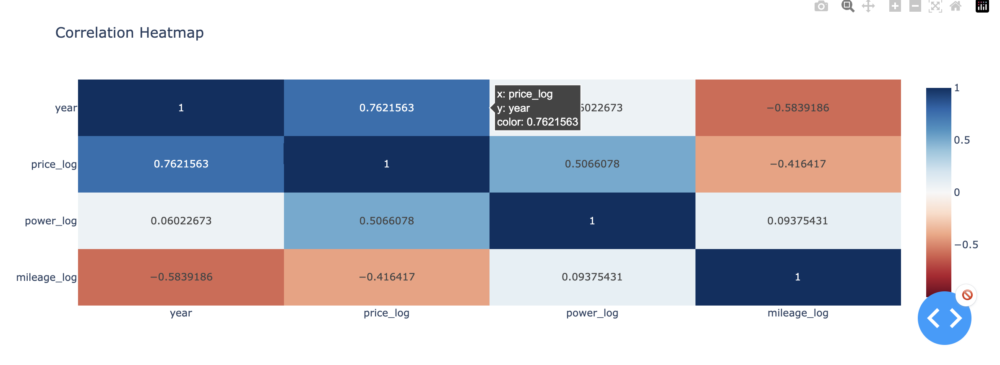

# German Used Car Analysis & Interactive Dashboard

[Github Link](https://github.com/KaungSiThu-Sallius/German-Used-Cars-Analysis.git)

## 🚀 Project Goal

This project performs an in-depth **Exploratory Data Analysis (EDA)** on a dataset of over **250,000 used car listings from Germany**.  
The primary objective is to act as a **data analyst** for a potential used car dealership — uncovering key insights to inform **purchasing, pricing, and sales strategy**.  
The analysis culminates in an **interactive dashboard** built with **Plotly Dash**.

---

## ✨ Key Features

- **Exploratory Data Analysis:** A comprehensive analysis in a Jupyter Notebook (`main.ipynb`) covering data cleaning, univariate analysis, bivariate analysis, and correlation studies.  
- **Intensive Data Cleaning:** The raw dataset contained numerous quality issues. The notebook details handling mixed units in fuel consumption columns, converting data types, and managing outliers.  
- **Interactive Dashboard:** A Plotly Dash web application (`app.py`) that allows users to dynamically filter and explore the dataset, including:
  - Histograms for price and mileage distributions  
  - Bar charts for the top 10 most popular brands and colors  
  - Box plots comparing price distributions across brands and colors 
  - A correlation heatmap of all numerical features  

---

## 📊 Dashboard Preview





---

## 🛠️ Technologies Used

- **Python 3.10**  
- **Data Analysis:** Pandas, NumPy  
- **Data Visualization:** Matplotlib, Seaborn, Plotly Express  
- **Dashboard Framework:** Plotly Dash  
- **Development Tools:** Jupyter Notebook, VS Code  

---

## 📂 Project Structure

```plaintext
├── data/
│   └── data.csv                     # The raw, original dataset
│   └── clean_used_cars_dataset.csv  # The cleaned dataset 
├── app.py                           # The interactive Plotly Dash application
├── main.ipynb                       # The Jupyter Notebook with the full EDA process
└── requirements.txt                 # Project dependencies
```

## 💡 Key Insights from the EDA

* **Price is driven by Power, Age, and Mileage:** The correlation heatmap revealed that engine power (`power_kw`) has the strongest positive correlation with price (0.62), while mileage and age have weaker but still significant negative and positive correlations, respectively.
* **Brand Power:** Premium brands like Audi, Mercedes-Benz, and Porsche consistently command higher median prices than mass-market brands like Opel.
* **Market Dominance:** German manufacturers like Volkswagen are the most frequently listed, indicating strong domestic brand loyalty.

---

## 🔮 Future Improvements

* **Machine Learning Model:** The cleaned dataset is well-prepared for the next step: building a regression model (e.g., using XGBoost) to predict used car prices.
* **Enhanced Dashboard:** Add more complex, chained callbacks to the dashboard for deeper, cross-filtered analysis.
* **Deployment:** Deploy the Plotly Dash application to a cloud service like Render or Heroku for public access.